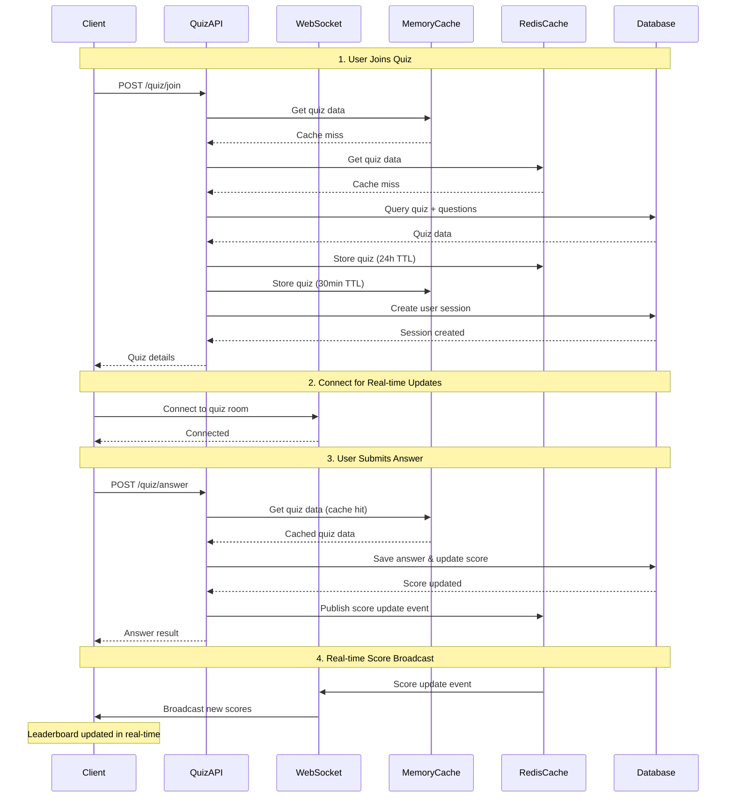

## Sequence diagram for Join Quiz and Answer Question use cases

```mermaid
sequenceDiagram
    participant Client
    participant QuizAPI
    participant WebSocket
    participant MemoryCache
    participant RedisCache
    participant Database

    Note over Client,Database: 1. User Joins Quiz
    Client->>QuizAPI: POST /quiz/join
    QuizAPI->>MemoryCache: Get quiz data
    MemoryCache-->>QuizAPI: Cache miss
    QuizAPI->>RedisCache: Get quiz data
    RedisCache-->>QuizAPI: Cache miss
    QuizAPI->>Database: Query quiz + questions
    Database-->>QuizAPI: Quiz data
    QuizAPI->>RedisCache: Store quiz (24h TTL)
    QuizAPI->>MemoryCache: Store quiz (30min TTL)
    QuizAPI->>Database: Create user session
    Database-->>QuizAPI: Session created
    QuizAPI-->>Client: Quiz details

    Note over Client,Database: 2. Connect for Real-time Updates
    Client->>WebSocket: Connect to quiz room
    WebSocket-->>Client: Connected

    Note over Client,Database: 3. User Submits Answer
    Client->>QuizAPI: POST /quiz/answer
    QuizAPI->>MemoryCache: Get quiz data (cache hit)
    MemoryCache-->>QuizAPI: Cached quiz data
    QuizAPI->>Database: Save answer & update score
    Database-->>QuizAPI: Score updated
    QuizAPI->>RedisCache: Publish score update event
    QuizAPI-->>Client: Answer result

    Note over Client,Database: 4. Real-time Score Broadcast
    RedisCache->>WebSocket: Score update event
    WebSocket->>Client: Broadcast new scores
    Note over Client: Leaderboard updated in real-time
```