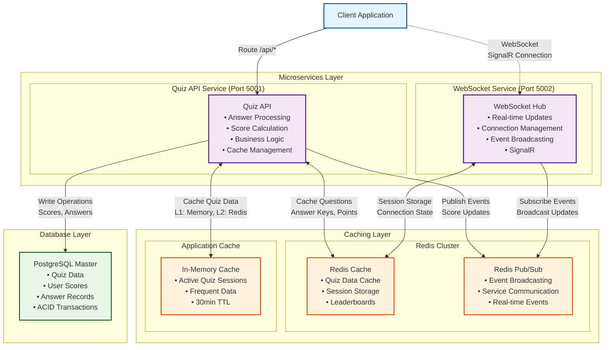

## System overview

### Conditions
Elsa has very high number of
- Total users: 15+ millions
- Users: 4+ millions/day
- Concurrent users, estimated to be
    - Normal peak: Around 25k-50k
    - Global peak: 75k-100k
    - Spikes: 150k+
The architecture I've chosen based on those numbers.

### Key decisions
- **Service Separation**: WebSocket service isolated to handle connection overhead without affecting API performance. Allow us to scale them separately.
- **Multi-Level Caching**: L1 (in-memory) + L2 (Redis) reduces database load by ~90%.
- **Redis Pub/Sub**: Enables real-time score updates across all connected clients. Simple to use. Consider using Kafka for higher throughput and better durability and guarantee delivery.
- **Partially adopt DDD**: Fully adopt DDD is not a good idea for Quiz application where (from my point of view) the logic is not complicate enough. But there are still a few things we can use:
    - Enhanced encapsulation and behavior-rich domain models.
    - Clear separation of concerns between application logic, domain logic and infrastructure logic.
    - (Almost) Always valid models

### Missing
#### Monitoring & Observability
Due to the time limit, I couldn't implement monitoring in the code, I will discuss about it in this session.

- **Health checks**: Since we are building a distributed system, making sure our dependencies are up and running is extremely crucial. We need to have health checks for our services.
- **Application/Infrastructure Metrics**: Knowing what our end-users are experiencing, how our infrastructure is working, what need to be fix ... is crucial.
- **Distributed tracing**: It's a must to have an overview of how a specific request is being served, across services/components.
- **Arlerting**: We need to know as soon as there is something bad happen to our Quiz application.

